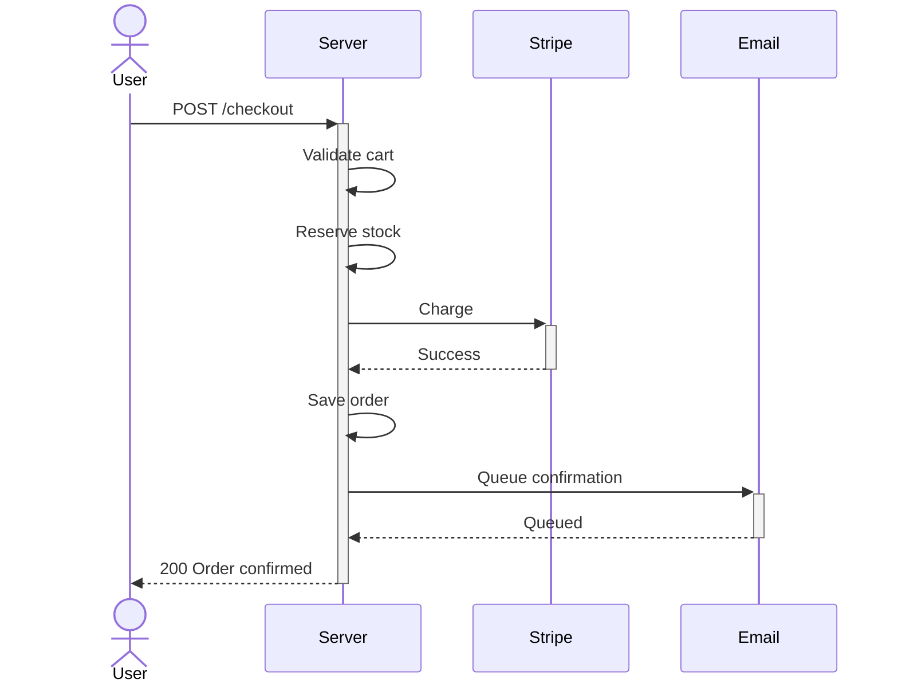
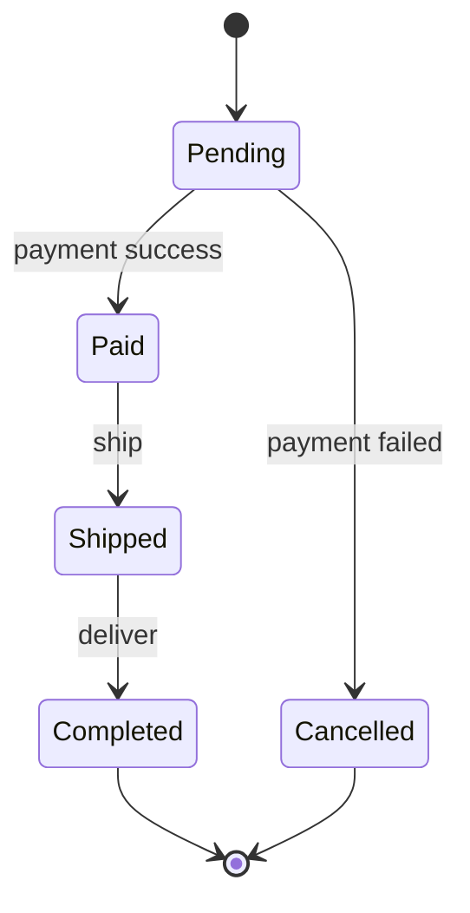
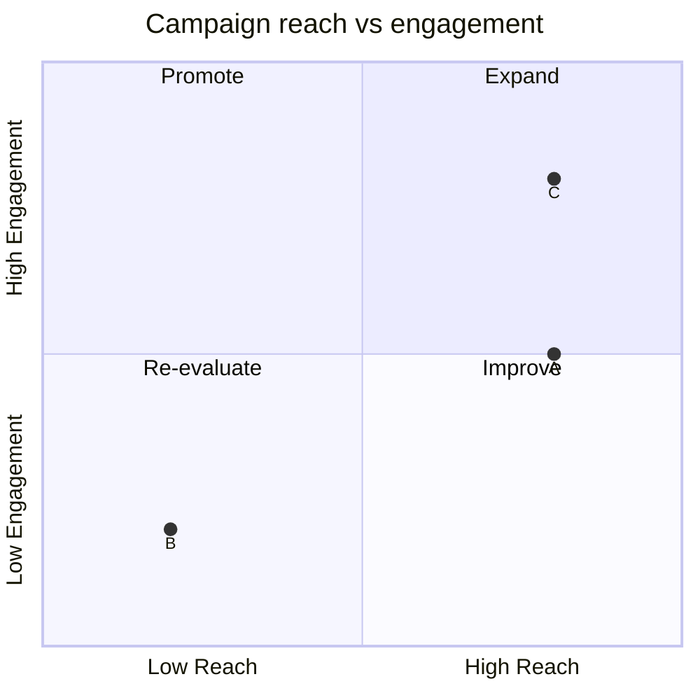

# Mermaid

Produce a valid, well-structured Mermaid diagram from the user's source material and intent. Pick the right diagram type, keep it readable, and emit it in a fenced `mermaid` code block.

## Reference Files

| File | Read When |
|------|-----------|
| `references/diagram-selection.md` | Default: choosing the right diagram type; one-line samples for each |
| `references/common-diagrams.md` | Generating flowchart, sequence, class, state, ER, or C4 diagrams |
| `references/specialized-diagrams.md` | Generating mindmap, gantt, timeline, journey, gitGraph, pie, quadrant, requirement, xychart, sankey, block, or architecture diagrams |
| `references/generation-guidelines.md` | Any diagram: label limits, structure rules, source-type strategies, anti-patterns |
| `references/styling-and-output.md` | Theming, classDef styling, frontmatter config, export, rendering targets |

## Workflow

Copy this checklist to track progress:

```text
Mermaid progress:
- [ ] Step 1: Pick diagram type
- [ ] Step 2: Gather source material
- [ ] Step 3: Draft structure
- [ ] Step 4: Generate Mermaid syntax
- [ ] Step 5: Validate
- [ ] Step 6: Present output
```

### Step 1: Pick diagram type

If the user named a type (e.g. "sequence diagram"), use it. Otherwise load `references/diagram-selection.md` and pick from its matrix. Common defaults:

| Content | Diagram |
|---------|---------|
| Process with decisions, branching logic | `flowchart` |
| Messages between actors/systems over time | `sequenceDiagram` |
| States and transitions (order lifecycle, workflow) | `stateDiagram-v2` |
| Database / domain entities with relationships | `erDiagram` |
| System architecture by level | `C4Context` / `C4Container` / `C4Component` |
| Concept hierarchy, brainstorm, overview | `mindmap` |

Ask the user to confirm only if two types fit equally well.

### Step 2: Gather source material

For topics or specs, ask one clarifying question if scope is ambiguous (e.g., "overview or detailed breakdown?"), then commit. For codebases, files, or conversations, pull only what's needed to name the nodes and relationships — don't scan more than needed.

### Step 3: Draft structure

Sketch the diagram's bones before writing syntax:

- List the nodes/entities/steps.
- List the relationships/messages/transitions.
- For flowchart, sequence, state: identify start and end. For ER, class: identify multiplicity. For C4: pick the right level.
- Apply the size and label rules in `references/generation-guidelines.md` — typically 5-20 nodes for readability.

### Step 4: Generate Mermaid syntax

Open the relevant reference file for the chosen type and write the diagram inside a fenced `mermaid` code block. Keep syntax minimal; add styling only when requested (see `references/styling-and-output.md`).

### Step 5: Validate

Run the common checks below, plus type-specific checks from the corresponding reference file. Revise and re-check if any fail.

Common checks:
- [ ] First line declares the correct diagram type (e.g. `flowchart TD`, `sequenceDiagram`)
- [ ] No unescaped `()[]{}` or stray colons inside plain text labels
- [ ] No blank lines inside the diagram block (breaks some renderers)
- [ ] Every referenced node / participant / entity is defined before use where required
- [ ] Direction and flow are consistent (top-down or left-right, not both)
- [ ] Label text is short enough to render (aim for under 6 words; see per-type rules)
- [ ] Total size is within the readable limit for the type (15-20 for flowchart/class; up to 40 for mindmap)

### Step 6: Present output

Output the diagram in a fenced `mermaid` code block. Note where it renders: GitHub/GitLab markdown, Mermaid Live Editor (`mermaid.live`), Notion, Obsidian, VS Code with a Mermaid preview extension.

If the user requests a file, write to a `.md` file containing the fenced block. For image export, point them to Mermaid Live Editor or `@mermaid-js/mermaid-cli` (see `references/styling-and-output.md`).

## Translation examples

How to turn typical source material into a diagram. Pattern: identify the type first, then extract nouns (nodes) and verbs (edges / transitions).

### Prose → sequenceDiagram

Source: "User hits Checkout. Server validates the cart, reserves stock, and charges Stripe. On success, the order is saved and a confirmation email is queued."



### Spec → stateDiagram

Source: "Orders start as Pending. Payment success moves to Paid; failure moves to Cancelled. Paid orders ship, then complete. Cancelled orders are terminal."



### Scoring matrix → quadrantChart

Source: "Rate campaigns on reach (low/high) and engagement (low/high). A is high-reach, mid-engagement. B is low-reach, low-engagement. C is high-reach, high-engagement."



## Anti-patterns

- Forcing everything into one diagram — split into multiple focused diagrams instead.
- Sentences as labels — extract keywords or move detail into child nodes / notes.
- Mixing two diagram types in one fenced block (not supported).
- Icons or Font Awesome references when the rendering target doesn't support them.
- Over-styling before the structure is validated.
- Guessing syntax — load the reference file for the chosen type.

## Related skills

- `presentation-creator` for slide decks that include diagrams
- `define-architecture` for detailed architecture decisions beyond visual diagrams
- `docs-writing` for embedding diagrams into technical documentation
